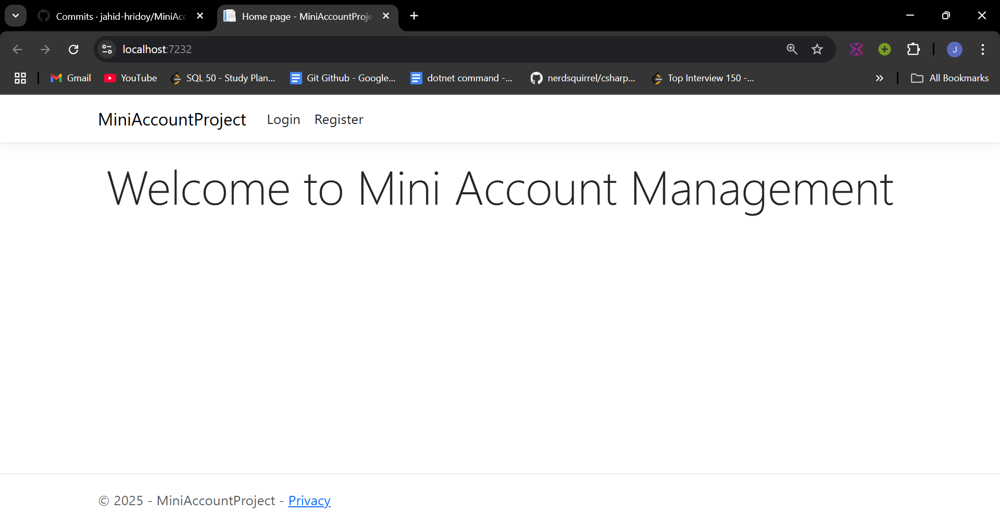
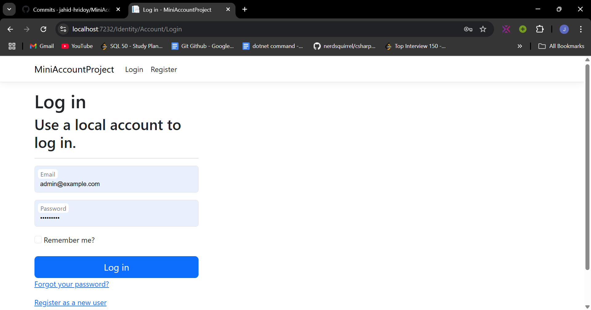
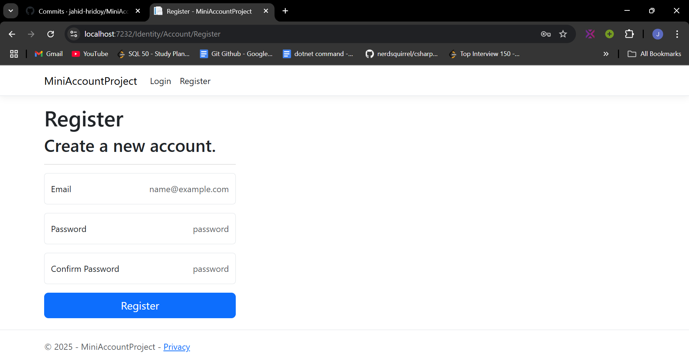
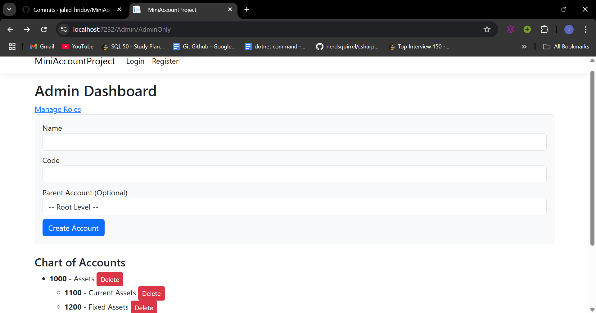
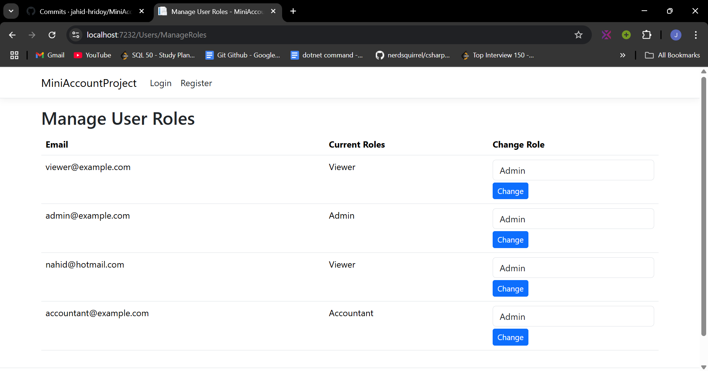
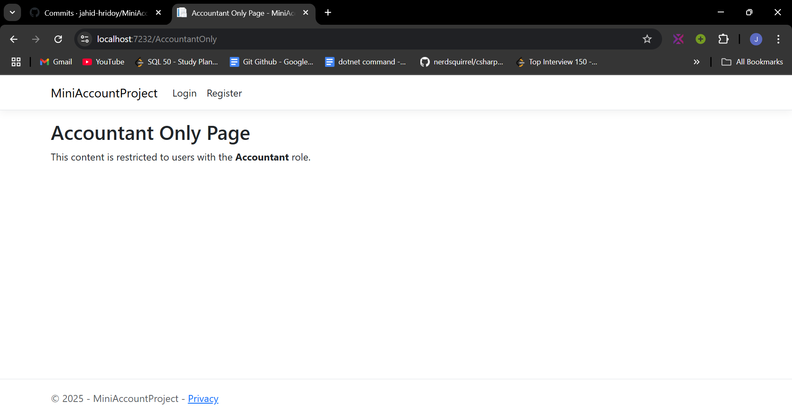
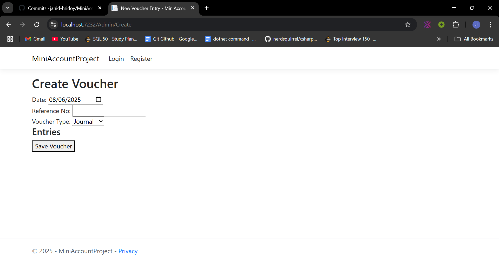
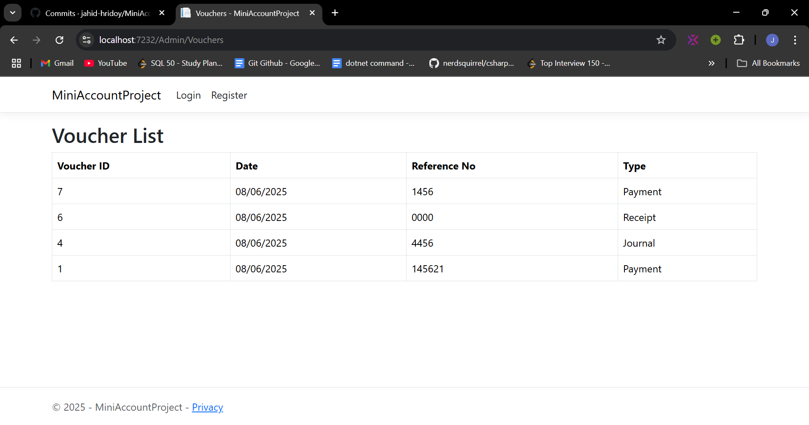

# MiniAccountProject

This is a simple yet functional **Mini Account Management System** built using **ASP.NET Core Razor Pages**. The system allows users to manage financial transactions through vouchers (Journal, Payment, and Receipt), track debit/credit entries, and maintain a basic chart of accounts.

## Features

- 🔐 User Authentication and Authorization with ASP.NET Core Identity
- 👤 Custom Role Management (Admin, Accountant, VIewer)
- 📅 Voucher Entry Module:
  - Journal, Payment, and Receipt Vouchers
  - Date and Reference Number fields
- 🧾 Chart of Accounts management
- 🗃️ SQL Server database with **stored procedures only** (no ORM like EF)

## Technologies Used

- ASP.NET Core Razor Pages (.NET Core)
- SQL Server with Stored Procedures
- Identity (with custom roles)

## Home Page
This is the Home Page of this project.

## Login Page
Any Registered User or Admin / Accountant have to login using this shared login page.

## Registration Page
New User Must Register to use this system.

## Admin Dashboard
The Admin Dashboard is the central control panel for managing the entire Mini Account Management System. It provides a secure and user-friendly interface for administrators to oversee accounts, vouchers, and user access.

✨ Key Features:
🔐 Role-Based Access Control

Manage user accounts and assign roles (e.g., Admin, Accountant).

Only authorized users can access admin functionalities.

📁 Chart of Accounts Management

🧾 Voucher Management

View all submitted Journal, Payment, and Receipt Vouchers.

Add New Voucher.

## Manage User Role
The Manage User Roles module allows administrators to control access and responsibilities within the system by assigning specific roles to users. This ensures that only authorized users can perform sensitive actions.

## Accoutant Only Page
The Accountant Only Page is a secure section of the system accessible exclusively by users with the Accountant role. It provides the core tools needed for day-to-day financial data entry and management. (Will Update this section...)

## Create Voucher
The Create Voucher page is the core financial entry screen of the Mini Account Management System, designed specifically for accountants to record financial transactions in the form of vouchers. It supports Journal, Payment, and Receipt voucher types.

## View Vouchers
The View Voucher page provides a detailed, read-only view of a single voucher entry. It allows only admins to inspect all voucher details, ensuring transparency and easy auditing of financial transactions.

## *This Mini Account Management System is a work in progress. I plan to continuously improve and expand its features eventually.*
